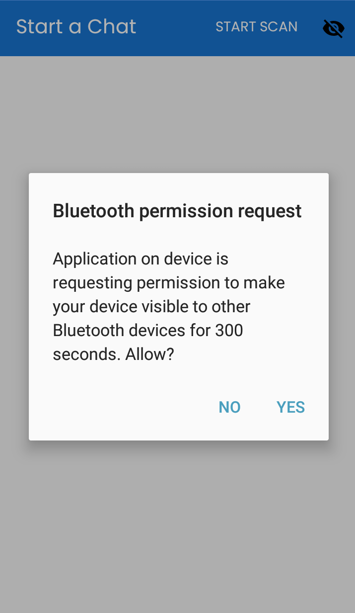
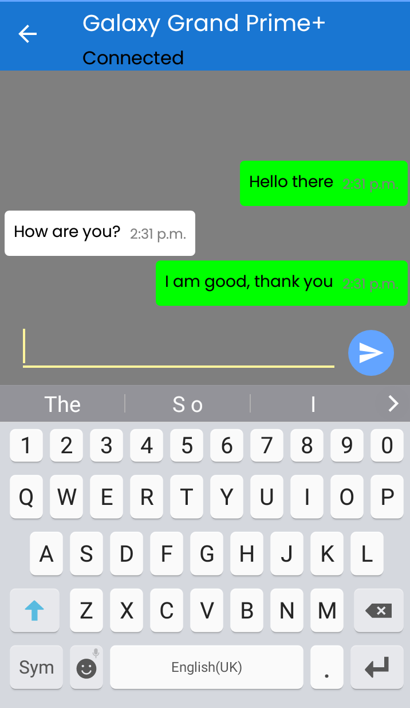
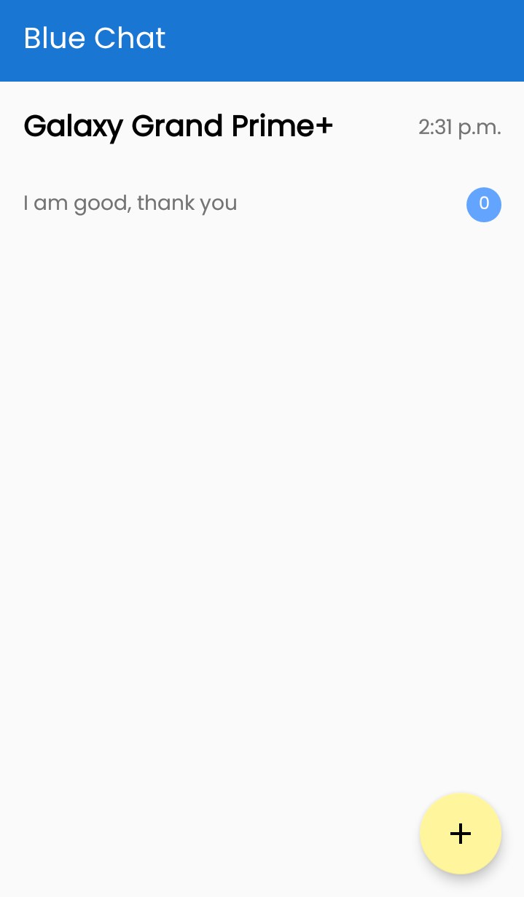

# Blue Chat
I'm a bit fond of chat app projects, so I decided to make one using Bluetooth. I used the Google Sample for inspiration

## Technologies Used
 - Android Bluetooth SDKs
 - Jetpack components like MVVM and LiveData  
A noteworthy mention is that I also used this project to learn Clean Architecture, something I feel I'll never walk back from.  
Also, I didn't use Room, everything's in memory.

## Screenshots
### Home No Chats

### Device Search

### Found Phone

### The Chat Feature

### Home with chats
